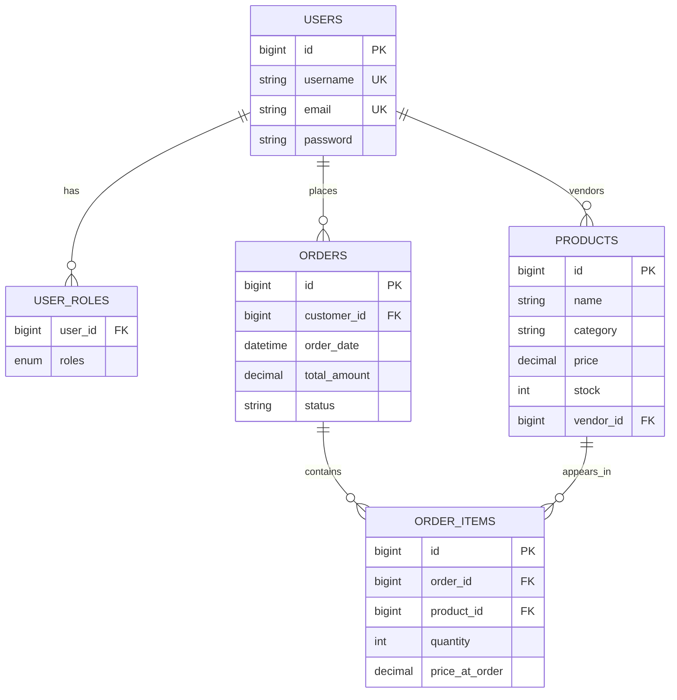

## ShopNexus Architecture and ER Diagram

### High-Level Architecture

Frontend (React + Vite) communicates with Backend (Spring Boot REST API) using JSON over HTTP.
Backend uses Spring Data JPA (Hibernate) to persist data in MySQL/H2.

### Backend Layers

- Controller Layer: request/response handling.
- Service Layer: business logic and validations.
- Repository Layer: database operations.
- Entity Layer: JPA mapped models.
- DTO Layer: input/output contracts.

### ER Diagram (Mermaid)

